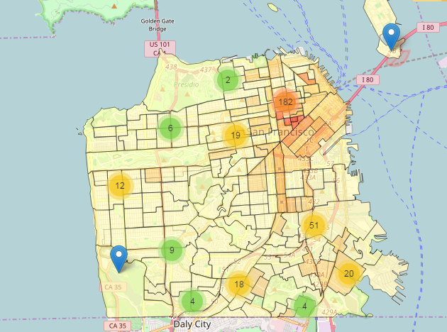

# Creating Web Maps in Python with GeoPandas and Folium

In this post, I demonstrate the use of the Python package Folium to create a web map from a GeoDataFrame. Folium is built on the Leaflet javascript library, which is a great tool for creating interactive web maps. However, I use Python for all of my data wrangling and analytical tasks, so it's really nice to be able to have the web-mapping capabilities from within the same environment. The goal of this post is to demonstrate a workflow between GeoPandas and Folium that makes it really easy to create functional and visually appealing web maps in Python.

In this example, I plot the point locations of crimes in San Francisco, overlaid on a choropleth of census tract crime density. Viewing these two layers together on a web map creates a nice way to get an overall sense of crime distribution, while also being able to view individual crime information. As I demonstrate below, these Python packages provide a nice, clean, and customizable way of doing this.

[Live Version](https://rawgit.com/agaidus/leaflet_webmaps_python/master/sf_assaults.html)
[Jupyter Notebook](sf_crime_mapping_final.ipynb)

[HTML Version](https://rawgit.com/agaidus/leaflet_webmaps_python/master/sf_crime_mapping_final.html)

